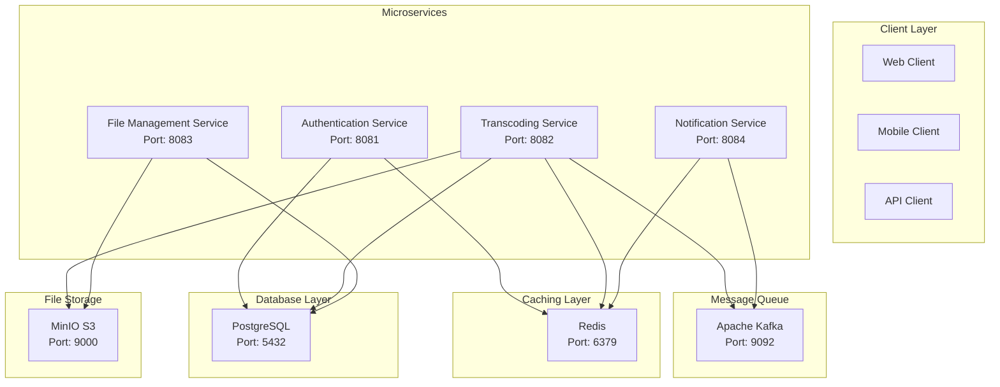

# Video Transcoding Service

A comprehensive Java Spring Boot microservices application for video transcoding with support for various codecs, formats, and quality settings. The service provides RESTful APIs for video conversion with configurable parameters including bitrate, frame rate, resolution, and processing mode (CPU/GPU).

## Project Information

- **Project Name**: Video Transcoding Service
- **Author**: Sanjay Naik
- **Company**: Sanjay Personal Projects
- **Description**: Sanjay Personal Projects For Learning and Testing
- **Version**: 1.0.0
- **Java Version**: 21 (LTS)
- **Spring Boot Version**: 3.3.5

## Features

- **Video Transcoding**: Support for multiple video codecs (H.264, H.265, AV1, VP9)
- **Audio Processing**: Multiple audio codecs (AAC, MP3, Opus, Vorbis)
- **Format Support**: Various output formats (MP4, WebM, AVI, MKV)
- **Quality Control**: Configurable bitrate, resolution, and frame rate
- **Processing Modes**: CPU and GPU acceleration support
- **System Information**: Detailed CPU/GPU information logging
- **Microservices Architecture**: Scalable and maintainable design
- **Message Queue Integration**: Async processing with Kafka
- **Caching**: Redis for performance optimization
- **File Storage**: MinIO S3-compatible storage
- **Monitoring**: Comprehensive monitoring with Prometheus and Grafana
- **JWT Authentication**: Secure token-based authentication
- **RESTful APIs**: Well-documented REST APIs for all operations

## Table of Contents

1. [Architecture Overview](#architecture-overview)
2. [Technology Stack](#technology-stack)
3. [Prerequisites](#prerequisites)
4. [Java 21 Setup](#java-21-setup)
5. [Quick Start](#quick-start)
6. [Installation & Configuration](#installation--configuration)
7. [API Documentation](#api-documentation)
8. [Security Configuration](#security-configuration)
9. [Docker Setup](#docker-setup)
10. [Postman Collection](#postman-collection)
11. [Development Guide](#development-guide)
12. [Testing](#testing)
13. [Monitoring](#monitoring)
14. [Troubleshooting](#troubleshooting)
15. [Java 21 Migration Guide](#java-21-migration-guide)
16. [Performance & Optimization](#performance--optimization)
17. [Contributing](#contributing)
18. [License](#license)

## Architecture Overview

The application consists of four microservices:

1. **Authentication Service** (Port: 8081) - User registration, login, and JWT token management
2. **Transcoding Service** (Port: 8082) - Video transcoding with FFmpeg integration
3. **File Management Service** (Port: 8083) - File upload, download, and storage management
4. **Notification Service** (Port: 8084) - User notifications and alerts

### System Architecture Diagram



## Technology Stack

- **Java**: 21 (LTS)
- **Spring Boot**: 3.3.5
- **Spring Security**: JWT-based authentication
- **Spring Data JPA**: PostgreSQL database
- **Spring Kafka**: Message queuing
- **Redis**: Caching and session management
- **MinIO**: S3-compatible object storage
- **FFmpeg**: Video transcoding engine
- **Docker**: Containerization
- **PostgreSQL**: Primary database
- **Maven**: 3.9+

## Prerequisites

- **Java 21 (LTS)** or higher
- **Maven 3.9+**
- **Docker 20.10+** and **Docker Compose 2.0+**
- **FFmpeg** (for local development)
- **8GB RAM** minimum
- **4 CPU cores** minimum
- **50GB storage** minimum

### Recommended for GPU Processing

- NVIDIA GPU with CUDA support
- NVIDIA Docker runtime
- CUDA 11.0+

## Java 21 Setup

### Current Status

✅ Java 21 is installed at: `C:\Program Files\Java\jdk-21`  
✅ Project is configured for Java 21  
✅ All code has been migrated to `com.sanjay.*` package structure  
✅ Build is successful when using Java 21

### Setting JAVA_HOME

**Option 1: Use the Batch Script (Temporary - Current Session Only)**

```bash
set-java21.bat
mvn clean install
```

**Option 2: Set JAVA_HOME Permanently (Recommended)**

#### Windows 10/11:

1. Open **System Properties**:
   - Press `Win + X` and select "System"
   - Click "Advanced system settings"
   - Click "Environment Variables"

2. Under **System variables**, find `JAVA_HOME`:
   - If it exists, click "Edit"
   - If it doesn't exist, click "New"
   - Set Variable name: `JAVA_HOME`
   - Set Variable value: `C:\Program Files\Java\jdk-21`

3. Update PATH:
   - Find `Path` in System variables
   - Click "Edit"
   - Add or update: `%JAVA_HOME%\bin`
   - Make sure it's at the top of the list

4. Restart your terminal/IDE

5. Verify:
```bash
java -version
# Should show: java version "21.0.3"

mvn -version
# Should show: Java version: 21.0.3
```

**Option 3: Set JAVA_HOME in PowerShell Profile**

Add to your PowerShell profile (`$PROFILE`):
```powershell
$env:JAVA_HOME = "C:\Program Files\Java\jdk-21"
$env:PATH = "C:\Program Files\Java\jdk-21\bin;" + $env:PATH
```

### IDE-Specific Configuration

#### IntelliJ IDEA:
1. File → Project Structure → Project
2. SDK: Select Java 21
3. File → Settings → Build, Execution, Deployment → Build Tools → Maven → Runner
4. JRE: Select Java 21

#### Eclipse/STS:
1. Window → Preferences → Java → Installed JREs
2. Add → Standard VM
3. JRE home: `C:\Program Files\Java\jdk-21`
4. Set as default

## Quick Start

### Step 1: Set JAVA_HOME to Java 21

**Option A: Use the batch script (Easiest)**
```bash
set-java21.bat
```

**Option B: Set manually in PowerShell**
```powershell
$env:JAVA_HOME = "C:\Program Files\Java\jdk-21"
$env:PATH = "C:\Program Files\Java\jdk-21\bin;" + $env:PATH
```

### Step 2: Verify Java Version

```bash
java -version
# Should show: java version "21.0.3"

mvn -version
# Should show: Java version: 21.0.3
```

### Step 3: Build the Project

#### Clone Repository

```bash
git clone <repository-url>
cd Video-Transcoding-SpringbootProject
```

#### Build All Services

```bash
# Clean and build all services
mvn clean install

# Skip tests (faster build)
mvn clean install -DskipTests

# Build with specific profile
mvn clean install -Pprod
```

**Expected output:**
```
[INFO] BUILD SUCCESS
[INFO] Reactor Summary:
[INFO] Video Transcoding Service .......................... SUCCESS
[INFO] Common Module ...................................... SUCCESS
[INFO] Authentication Service ............................. SUCCESS
[INFO] Transcoding Service ................................ SUCCESS
[INFO] File Management Service ............................ SUCCESS
[INFO] Notification Service ............................... SUCCESS
```

#### Build Individual Services

```bash
# Build specific service
mvn clean install -pl auth-service
mvn clean install -pl transcoding-service
mvn clean install -pl file-service
mvn clean install -pl notification-service
mvn clean install -pl common

# Build with dependencies
mvn clean install -pl auth-service -am
```

#### Build Options

```bash
# Build without running tests
mvn clean install -DskipTests

# Build with test but skip integration tests
mvn clean install -DskipITs

# Build with verbose output
mvn clean install -X

# Build offline (use cached dependencies)
mvn clean install -o
```

#### Verify Build

After successful build, verify JAR files are created:

```bash
# Check JAR files
ls -la auth-service/target/*.jar
ls -la transcoding-service/target/*.jar
ls -la file-service/target/*.jar
ls -la notification-service/target/*.jar
```

### Step 4: Start with Docker Compose

```bash
# Start all services
docker-compose up -d

# View logs
docker-compose logs -f

# Stop all services
docker-compose down
```

### Step 5: Access Services

- **Auth Service**: http://localhost:8081
- **Transcoding Service**: http://localhost:8082
- **File Service**: http://localhost:8083
- **Notification Service**: http://localhost:8084
- **MinIO Console**: http://localhost:9001 (minioadmin/minioadmin123)

## Installation & Configuration

### Environment Variables

Create a `.env` file in the root directory:

```bash
# Database Configuration
POSTGRES_DB=transcode_db
POSTGRES_USER=transcode_user
POSTGRES_PASSWORD=secure_password_123
POSTGRES_HOST=postgres
POSTGRES_PORT=5432

# Redis Configuration
REDIS_HOST=redis
REDIS_PORT=6379
REDIS_PASSWORD=redis_password_123

# Kafka Configuration
KAFKA_BOOTSTRAP_SERVERS=kafka:29092
KAFKA_GROUP_ID=transcode-service-group

# MinIO Configuration
MINIO_ENDPOINT=http://minio:9000
MINIO_ACCESS_KEY=minioadmin
MINIO_SECRET_KEY=minioadmin123
MINIO_BUCKET_NAME=video-files

# JWT Configuration
JWT_SECRET=your-super-secret-jwt-key-change-this-in-production
JWT_EXPIRATION=86400000

# FFmpeg Configuration
FFMPEG_PATH=/usr/local/bin/ffmpeg
FFPROBE_PATH=/usr/local/bin/ffprobe

# Processing Configuration
MAX_CONCURRENT_JOBS=4
TEMP_DIR=/tmp/transcode
OUTPUT_DIR=/app/output

# GPU Configuration
ENABLE_GPU_ACCELERATION=false
CUDA_VISIBLE_DEVICES=0

# Logging
LOG_LEVEL=INFO
LOG_FILE_PATH=/var/log/transcode-service.log
```

## Complete Workflow Example

This section demonstrates a complete workflow from user registration to video transcoding using curl commands.

### Step-by-Step Workflow

#### 1. Register a New User

```bash
curl -X POST http://localhost:8081/api/auth/register \
  -H "Content-Type: application/json" \
  -d '{
    "username": "testuser",
    "email": "test@example.com",
    "password": "password123"
  }'
```

**Save the token from response:**
```bash
# Extract token (example - adjust based on your shell)
TOKEN=$(curl -s -X POST http://localhost:8081/api/auth/register \
  -H "Content-Type: application/json" \
  -d '{"username":"testuser","email":"test@example.com","password":"password123"}' \
  | jq -r '.token')

echo "Token: $TOKEN"
```

#### 2. Login (Alternative to Registration)

```bash
curl -X POST http://localhost:8081/api/auth/login \
  -H "Content-Type: application/json" \
  -d '{
    "username": "testuser",
    "password": "password123"
  }'
```

#### 3. Upload a Video File

```bash
curl -X POST http://localhost:8083/api/files/upload \
  -H "Authorization: Bearer $TOKEN" \
  -F "file=@/path/to/your/video.mp4" \
  -F "description=My test video file"
```

**Save the file ID from response:**
```bash
FILE_ID=$(curl -s -X POST http://localhost:8083/api/files/upload \
  -H "Authorization: Bearer $TOKEN" \
  -F "file=@/path/to/your/video.mp4" \
  -F "description=My test video" \
  | jq -r '.id')

echo "File ID: $FILE_ID"
```

#### 4. Create a Transcoding Job

```bash
curl -X POST http://localhost:8082/api/transcode/jobs \
  -H "Authorization: Bearer $TOKEN" \
  -H "Content-Type: application/json" \
  -d "{
    \"inputFileId\": \"$FILE_ID\",
    \"outputSettings\": {
      \"videoCodec\": \"libx264\",
      \"audioCodec\": \"aac\",
      \"outputFormat\": \"mp4\",
      \"videoBitrate\": \"2000k\",
      \"audioBitrate\": \"128k\",
      \"resolution\": \"1920x1080\",
      \"frameRate\": 30,
      \"processingMode\": \"CPU\"
    },
    \"priority\": \"NORMAL\"
  }"
```

**Save the job ID:**
```bash
JOB_ID=$(curl -s -X POST http://localhost:8082/api/transcode/jobs \
  -H "Authorization: Bearer $TOKEN" \
  -H "Content-Type: application/json" \
  -d "{\"inputFileId\":\"$FILE_ID\",\"outputSettings\":{\"videoCodec\":\"libx264\",\"audioCodec\":\"aac\",\"outputFormat\":\"mp4\",\"videoBitrate\":\"2000k\",\"audioBitrate\":\"128k\",\"resolution\":\"1920x1080\",\"frameRate\":30,\"processingMode\":\"CPU\"},\"priority\":\"NORMAL\"}" \
  | jq -r '.id')

echo "Job ID: $JOB_ID"
```

#### 5. Check Job Status

```bash
# Check job status
curl -X GET http://localhost:8082/api/transcode/jobs/$JOB_ID \
  -H "Authorization: Bearer $TOKEN"

# Poll until completed (example script)
while true; do
  STATUS=$(curl -s -X GET http://localhost:8082/api/transcode/jobs/$JOB_ID \
    -H "Authorization: Bearer $TOKEN" | jq -r '.status')
  
  echo "Job Status: $STATUS"
  
  if [ "$STATUS" = "COMPLETED" ] || [ "$STATUS" = "FAILED" ]; then
    break
  fi
  
  sleep 5
done
```

#### 6. Get Notifications

```bash
# Get all notifications
curl -X GET "http://localhost:8084/api/notifications?page=0&size=10" \
  -H "Authorization: Bearer $TOKEN"

# Get only unread notifications
curl -X GET "http://localhost:8084/api/notifications?status=UNREAD&page=0&size=10" \
  -H "Authorization: Bearer $TOKEN"
```

#### 7. Download Transcoded File

```bash
# Download the transcoded file
curl -X GET http://localhost:8083/api/files/$FILE_ID/download \
  -H "Authorization: Bearer $TOKEN" \
  -o transcoded_video.mp4
```

### Complete Bash Script Example

```bash
#!/bin/bash

# Configuration
BASE_URL="http://localhost:8081"
USERNAME="testuser"
EMAIL="test@example.com"
PASSWORD="password123"
VIDEO_FILE="/path/to/video.mp4"

# Step 1: Register
echo "Step 1: Registering user..."
REGISTER_RESPONSE=$(curl -s -X POST $BASE_URL/api/auth/register \
  -H "Content-Type: application/json" \
  -d "{\"username\":\"$USERNAME\",\"email\":\"$EMAIL\",\"password\":\"$PASSWORD\"}")

TOKEN=$(echo $REGISTER_RESPONSE | jq -r '.token')
echo "Token obtained: ${TOKEN:0:20}..."

# Step 2: Upload file
echo "Step 2: Uploading video file..."
UPLOAD_RESPONSE=$(curl -s -X POST http://localhost:8083/api/files/upload \
  -H "Authorization: Bearer $TOKEN" \
  -F "file=@$VIDEO_FILE" \
  -F "description=Test video upload")

FILE_ID=$(echo $UPLOAD_RESPONSE | jq -r '.id')
echo "File uploaded. File ID: $FILE_ID"

# Step 3: Create transcoding job
echo "Step 3: Creating transcoding job..."
JOB_RESPONSE=$(curl -s -X POST http://localhost:8082/api/transcode/jobs \
  -H "Authorization: Bearer $TOKEN" \
  -H "Content-Type: application/json" \
  -d "{
    \"inputFileId\": \"$FILE_ID\",
    \"outputSettings\": {
      \"videoCodec\": \"libx264\",
      \"audioCodec\": \"aac\",
      \"outputFormat\": \"mp4\",
      \"videoBitrate\": \"2000k\",
      \"audioBitrate\": \"128k\",
      \"resolution\": \"1920x1080\",
      \"frameRate\": 30,
      \"processingMode\": \"CPU\"
    },
    \"priority\": \"NORMAL\"
  }")

JOB_ID=$(echo $JOB_RESPONSE | jq -r '.id')
echo "Job created. Job ID: $JOB_ID"

# Step 4: Monitor job status
echo "Step 4: Monitoring job status..."
while true; do
  STATUS_RESPONSE=$(curl -s -X GET http://localhost:8082/api/transcode/jobs/$JOB_ID \
    -H "Authorization: Bearer $TOKEN")
  
  STATUS=$(echo $STATUS_RESPONSE | jq -r '.status')
  PROGRESS=$(echo $STATUS_RESPONSE | jq -r '.progress // 0')
  
  echo "Status: $STATUS, Progress: $PROGRESS%"
  
  if [ "$STATUS" = "COMPLETED" ]; then
    echo "Job completed successfully!"
    break
  elif [ "$STATUS" = "FAILED" ]; then
    echo "Job failed!"
    break
  fi
  
  sleep 5
done

echo "Workflow completed!"
```

## API Documentation

### Authentication Service (Port: 8081)

#### Register User

```bash
curl -X POST http://localhost:8081/api/auth/register \
  -H "Content-Type: application/json" \
  -d '{
    "username": "testuser",
    "email": "test@example.com",
    "password": "password123"
  }'
```

**Response:**
```json
{
  "token": "eyJhbGciOiJIUzI1NiIsInR5cCI6IkpXVCJ9...",
  "refreshToken": "refresh_token_here",
  "user": {
    "id": "user-uuid",
    "username": "testuser",
    "email": "test@example.com",
    "role": "USER"
  },
  "message": "User registered successfully"
}
```

#### Login

```bash
curl -X POST http://localhost:8081/api/auth/login \
  -H "Content-Type: application/json" \
  -d '{
    "username": "testuser",
    "password": "password123"
  }'
```

**Response:**
```json
{
  "token": "eyJhbGciOiJIUzI1NiIsInR5cCI6IkpXVCJ9...",
  "refreshToken": "refresh_token_here",
  "user": {
    "id": "user-uuid",
    "username": "testuser",
    "email": "test@example.com",
    "role": "USER",
    "createdAt": "2024-01-01T10:00:00",
    "lastLogin": "2024-01-01T10:30:00",
    "isActive": true
  },
  "message": "Login successful"
}
```

**Note:** Save the `token` from the response to use in subsequent API calls as `YOUR_JWT_TOKEN`.

#### Health Check

```bash
curl -X GET http://localhost:8081/api/auth/health
```

### File Management Service (Port: 8083)

#### Upload Video File

```bash
# Basic upload
curl -X POST http://localhost:8083/api/files/upload \
  -H "Authorization: Bearer YOUR_JWT_TOKEN" \
  -F "file=@/path/to/video.mp4" \
  -F "description=Test video upload"

# Upload with Windows path (PowerShell)
curl -X POST http://localhost:8083/api/files/upload `
  -H "Authorization: Bearer YOUR_JWT_TOKEN" `
  -F "file=@C:\Users\YourName\Videos\video.mp4" `
  -F "description=My video file"
```

**Response:**
```json
{
  "id": "file-uuid",
  "userId": "user-uuid",
  "originalFilename": "video.mp4",
  "storedFilename": "stored-uuid.mp4",
  "fileSize": 52428800,
  "contentType": "video/mp4",
  "description": "Test video upload",
  "uploadedAt": "2024-01-01T10:00:00",
  "isProcessed": false
}
```

**Supported File Types:**
- Video: `.mp4`, `.avi`, `.mov`, `.mkv`, `.webm`, `.flv`
- Maximum file size: Configurable (default: 2GB)

#### Get File Information

```bash
curl -X GET http://localhost:8083/api/files/{fileId} \
  -H "Authorization: Bearer YOUR_JWT_TOKEN"
```

#### Download File

```bash
curl -X GET http://localhost:8083/api/files/{fileId}/download \
  -H "Authorization: Bearer YOUR_JWT_TOKEN" \
  -o downloaded_video.mp4
```

#### Get User Files (Paginated)

```bash
curl -X GET "http://localhost:8083/api/files?page=0&size=10" \
  -H "Authorization: Bearer YOUR_JWT_TOKEN"
```

#### Delete File

```bash
curl -X DELETE http://localhost:8083/api/files/{fileId} \
  -H "Authorization: Bearer YOUR_JWT_TOKEN"
```

#### Update File Description

```bash
curl -X PUT http://localhost:8083/api/files/{fileId}/description \
  -H "Authorization: Bearer YOUR_JWT_TOKEN" \
  -H "Content-Type: text/plain" \
  -d "Updated description for my video file"
```

### Transcoding Service (Port: 8082)

#### Get System Information

```bash
curl -X GET http://localhost:8082/api/transcode/system-info \
  -H "Authorization: Bearer YOUR_JWT_TOKEN"
```

**Response:**
```json
{
  "cpuInfo": "Intel(R) Core(TM) i7-10700K CPU @ 3.80GHz",
  "gpuInfo": "NVIDIA GeForce RTX 3070",
  "totalMemory": 17179869184,
  "availableMemory": 8589934592,
  "cpuCores": 8,
  "cpuUsage": 25.5,
  "memoryUsage": 45.2,
  "ffmpegVersion": "4.4.2",
  "ffprobeVersion": "4.4.2",
  "gpuAccelerationEnabled": false
}
```

#### Create Transcoding Job

```bash
curl -X POST http://localhost:8082/api/transcode/jobs \
  -H "Authorization: Bearer YOUR_JWT_TOKEN" \
  -H "Content-Type: application/json" \
  -d '{
    "inputFileId": "file-uuid-123",
    "outputSettings": {
      "videoCodec": "libx264",
      "audioCodec": "aac",
      "outputFormat": "mp4",
      "videoBitrate": "2000k",
      "audioBitrate": "128k",
      "resolution": "1920x1080",
      "frameRate": 30,
      "processingMode": "CPU"
    },
    "priority": "NORMAL"
  }'
```

**Available Options:**
- **Video Codecs:** `libx264`, `libx265`, `libvpx-vp9`, `libaom-av1`
- **Audio Codecs:** `aac`, `mp3`, `opus`, `vorbis`
- **Output Formats:** `mp4`, `webm`, `avi`, `mkv`
- **Processing Modes:** `CPU`, `GPU` (if available)
- **Priority:** `LOW`, `NORMAL`, `HIGH`, `URGENT`

#### Get Transcoding Job Status

```bash
curl -X GET http://localhost:8082/api/transcode/jobs/{jobId} \
  -H "Authorization: Bearer YOUR_JWT_TOKEN"
```

**Response:**
```json
{
  "id": "job-uuid",
  "userId": "user-uuid",
  "inputFileId": "file-uuid-here",
  "outputFilename": "output_video.mp4",
  "status": "PROCESSING",
  "priority": "NORMAL",
  "outputSettings": {
    "videoCodec": "libx264",
    "audioCodec": "aac",
    "outputFormat": "mp4",
    "videoBitrate": "2000k",
    "audioBitrate": "128k",
    "resolution": "1920x1080",
    "frameRate": 30,
    "processingMode": "CPU"
  },
  "progress": 45,
  "createdAt": "2024-01-01T10:00:00",
  "startedAt": "2024-01-01T10:01:00",
  "completedAt": null,
  "errorMessage": null
}
```

**Job Status Values:**
- `QUEUED` - Job is waiting in the queue
- `PROCESSING` - Job is currently being processed
- `COMPLETED` - Job completed successfully
- `FAILED` - Job failed with an error
- `CANCELLED` - Job was cancelled

#### Get All User Jobs

```bash
# Get all jobs
curl -X GET "http://localhost:8082/api/transcode/jobs?page=0&size=10" \
  -H "Authorization: Bearer YOUR_JWT_TOKEN"

# Get jobs by status
curl -X GET "http://localhost:8082/api/transcode/jobs?status=COMPLETED&page=0&size=10" \
  -H "Authorization: Bearer YOUR_JWT_TOKEN"

# Get jobs with sorting
curl -X GET "http://localhost:8082/api/transcode/jobs?page=0&size=10&sort=createdAt,desc" \
  -H "Authorization: Bearer YOUR_JWT_TOKEN"
```

**Query Parameters:**
- `page` (optional): Page number (default: 0)
- `size` (optional): Page size (default: 10)
- `status` (optional): Filter by status (`QUEUED`, `PROCESSING`, `COMPLETED`, `FAILED`, `CANCELLED`)
- `sort` (optional): Sort field and direction (e.g., `createdAt,desc`)

**Response:**
```json
{
  "content": [
    {
      "id": "job-uuid-1",
      "userId": "user-uuid",
      "inputFileId": "file-uuid-here",
      "outputFilename": "output_video.mp4",
      "status": "COMPLETED",
      "priority": "NORMAL",
      "progress": 100,
      "createdAt": "2024-01-01T10:00:00",
      "startedAt": "2024-01-01T10:01:00",
      "completedAt": "2024-01-01T10:05:00",
      "errorMessage": null
    }
  ],
  "pageable": {
    "pageNumber": 0,
    "pageSize": 10,
    "sort": {
      "sorted": false,
      "unsorted": true
    }
  },
  "totalElements": 1,
  "totalPages": 1,
  "last": true,
  "first": true,
  "numberOfElements": 1
}
```

#### Cancel Transcoding Job

```bash
curl -X DELETE http://localhost:8082/api/transcode/jobs/{jobId} \
  -H "Authorization: Bearer YOUR_JWT_TOKEN"
```

#### Bulk Transcode

```bash
curl -X POST http://localhost:8082/api/transcode/bulk \
  -H "Authorization: Bearer YOUR_JWT_TOKEN" \
  -H "Content-Type: application/json" \
  -d '{
    "inputFileIds": ["file-uuid-1", "file-uuid-2"],
    "outputSettings": {
      "videoCodec": "libx265",
      "audioCodec": "aac",
      "outputFormat": "mp4",
      "videoBitrate": "1500k",
      "audioBitrate": "128k",
      "resolution": "1280x720",
      "frameRate": 24,
      "processingMode": "GPU"
    }
  }'
```

### Notification Service (Port: 8084)

#### Get User Notifications

```bash
curl -X GET "http://localhost:8084/api/notifications?page=0&size=10&status=UNREAD" \
  -H "Authorization: Bearer YOUR_JWT_TOKEN"
```

#### Mark Notification as Read

```bash
curl -X PATCH http://localhost:8084/api/notifications/{notificationId}/read \
  -H "Authorization: Bearer YOUR_JWT_TOKEN"
```

#### Mark All as Read

```bash
curl -X PATCH http://localhost:8084/api/notifications/read-all \
  -H "Authorization: Bearer YOUR_JWT_TOKEN"
```

#### Get Unread Count

```bash
curl -X GET http://localhost:8084/api/notifications/unread-count \
  -H "Authorization: Bearer YOUR_JWT_TOKEN"
```

#### Delete Notification

```bash
curl -X DELETE http://localhost:8084/api/notifications/{notificationId} \
  -H "Authorization: Bearer YOUR_JWT_TOKEN"
```

### Error Handling

#### Common HTTP Status Codes

| Status Code | Description | Common Causes |
|-------------|-------------|---------------|
| 200 | OK | Request successful |
| 201 | Created | Resource created successfully |
| 204 | No Content | Request successful, no content returned |
| 400 | Bad Request | Invalid request data or parameters |
| 401 | Unauthorized | Missing or invalid JWT token |
| 403 | Forbidden | Insufficient permissions |
| 404 | Not Found | Resource not found |
| 409 | Conflict | Resource already exists |
| 422 | Unprocessable Entity | Validation errors |
| 500 | Internal Server Error | Server-side error |

#### Error Response Format

```json
{
  "timestamp": "2024-01-01T10:00:00.000Z",
  "status": 400,
  "error": "Bad Request",
  "message": "Validation failed",
  "path": "/api/auth/register",
  "details": [
    {
      "field": "username",
      "message": "Username is required"
    }
  ]
}
```

## Security Configuration

### Current Security Configuration

The `SecurityConfig.java` currently has:
- **Public endpoints** (no authentication required): `/api/auth/register`, `/api/auth/login`, `/api/auth/health`, `/actuator/**`
- **Protected endpoints** (authentication required): All other endpoints

### Adding a New Protected Endpoint

**Step 1:** Add the endpoint to your controller

```java
@GetMapping("/profile")
public ResponseEntity<UserProfile> getProfile() {
    String username = SecurityContextHolder.getContext().getAuthentication().getName();
    // ... your logic
}
```

**Step 2:** No changes needed in SecurityConfig

By default, **all endpoints are protected** unless explicitly added to `permitAll()`. So your new endpoint will automatically require authentication.

### Adding a New Public Endpoint

**Step 1:** Add the endpoint to your controller

```java
@GetMapping("/public-info")
public ResponseEntity<String> getPublicInfo() {
    return ResponseEntity.ok("Public information");
}
```

**Step 2:** Add the endpoint to SecurityConfig's permitAll()

```java
@Bean
public SecurityFilterChain filterChain(HttpSecurity http) throws Exception {
    http
        .csrf(csrf -> csrf.disable())
        .cors(cors -> cors.and())
        .sessionManagement(session -> session.sessionCreationPolicy(SessionCreationPolicy.STATELESS))
        .authorizeHttpRequests(auth -> auth
            .requestMatchers(
                "/api/auth/register", 
                "/api/auth/login", 
                "/api/auth/health",
                "/api/auth/public-info",  // ← NEW PUBLIC ENDPOINT
                "/actuator/**"
            ).permitAll()
            .anyRequest().authenticated()
        );
    
    return http.build();
}
```

### Accessing User Information in Protected Endpoints

```java
@GetMapping("/profile")
public ResponseEntity<UserProfile> getProfile() {
    Authentication auth = SecurityContextHolder.getContext().getAuthentication();
    String username = auth.getName();  // Username from token
    Collection<? extends GrantedAuthority> authorities = auth.getAuthorities();  // Roles
    
    return ResponseEntity.ok(userProfile);
}
```

## Docker Setup

### Docker Configuration

All Dockerfiles have been updated to use **Java 21**:

**Base Image Migration:**
- **From**: `openjdk:11-jre-slim` (Debian-based, Java 11)
- **To**: `eclipse-temurin:21-jre-alpine` (Alpine Linux, Java 21)

**Benefits:**
1. **Smaller image size**: Alpine Linux is much smaller (~5MB vs ~100MB)
2. **Java 21 LTS**: Latest long-term support version
3. **Better security**: Alpine uses musl libc and has a smaller attack surface
4. **Faster builds**: Smaller base image means faster downloads

### Building Docker Images

```bash
# Build all services
docker-compose build

# Build specific service
docker-compose build auth-service
```

### Running Services

```bash
# Start all services
docker-compose up -d

# Start specific service
docker-compose up -d auth-service

# View logs
docker-compose logs -f auth-service
```

### Verify Java Version in Containers

```bash
# Check Java version in a container
docker exec transcode-auth-service java -version
# Should show: openjdk version "21.x.x"

# Check all services
docker exec transcode-auth-service java -version
docker exec transcode-service java -version
docker exec transcode-file-service java -version
docker exec transcode-notification-service java -version
```

### Health Check Endpoints

All health check endpoints are verified and working:

- **Auth Service**: `http://localhost:8081/api/auth/health`
- **Transcoding Service**: `http://localhost:8082/api/transcode/health`
- **File Service**: `http://localhost:8083/api/files/health`
- **Notification Service**: `http://localhost:8084/api/notifications/health`

## Postman Collection

### Overview

The Postman collection provides comprehensive API testing for all microservices. The collection includes:

- **Authentication Service** (Port 8081)
- **Transcoding Service** (Port 8082)
- **File Management Service** (Port 8083)
- **Notification Service** (Port 8084)
- **Actuator Endpoints** for all services

### Import Collection and Environment

1. **Import Collection:**
   - Open Postman
   - Click "Import" button
   - Select `Video_Transcoding_Service.postman_collection.json`
   - Click "Import"

2. **Import Environment:**
   - Click "Import" button
   - Select `Video_Transcoding_Service.postman_environment.json`
   - Click "Import"
   - Select the environment from the dropdown (top right)

### Environment Variables

| Variable | Default Value | Description |
|----------|---------------|-------------|
| `base_url_auth` | `http://localhost:8081` | Authentication service base URL |
| `base_url_transcode` | `http://localhost:8082` | Transcoding service base URL |
| `base_url_file` | `http://localhost:8083` | File service base URL |
| `base_url_notification` | `http://localhost:8084` | Notification service base URL |
| `jwt_token` | (auto-set) | JWT authentication token |
| `user_id` | (auto-set) | Current user ID |
| `file_id` | (auto-set) | File ID from upload |
| `job_id` | (auto-set) | Transcoding job ID |

### Complete Testing Workflow

1. **Register/Login** → Get JWT token (automatically saved)
2. **Upload File** → Get fileId (automatically saved)
3. **Create Transcoding Job** → Get jobId (automatically saved)
4. **Check Job Status** → Monitor transcoding progress
5. **Get Notifications** → View job completion notifications

### Actuator Endpoints

All services expose Spring Boot Actuator endpoints:

- **Health**: `/actuator/health` - Service health status
- **Info**: `/actuator/info` - Application information
- **Metrics**: `/actuator/metrics` - List all available metrics
- **Prometheus** (Transcoding Service only): `/actuator/prometheus` - Prometheus metrics format

## Development Guide

### Local Development Setup

1. **Start Infrastructure Services**:
   ```bash
   docker-compose up -d postgres redis kafka minio
   ```

2. **Run Services Locally**:
   ```bash
   # Auth Service
   cd auth-service && mvn spring-boot:run
   
   # Transcoding Service
   cd transcoding-service && mvn spring-boot:run
   
   # File Service
   cd file-service && mvn spring-boot:run
   
   # Notification Service
   cd notification-service && mvn spring-boot:run
   ```

### Building Individual Services

```bash
# Build specific service
mvn clean install -pl auth-service
mvn clean install -pl transcoding-service
mvn clean install -pl file-service
mvn clean install -pl notification-service

# Build all services
mvn clean install
```

### Project Structure

```
Video-Transcoding-SpringbootProject/
├── common/                    # Common module (common-jar)
│   └── src/main/java/com/sanjay/common/
├── auth-service/              # Authentication service
│   └── src/main/java/com/sanjay/auth/
├── transcoding-service/       # Video transcoding service
│   └── src/main/java/com/sanjay/transcoding/
├── file-service/             # File management service
│   └── src/main/java/com/sanjay/file/
└── notification-service/      # Notification service
    └── src/main/java/com/sanjay/notification/
```

## Testing

### Run Tests

```bash
# Run all tests
mvn test

# Run tests for specific service
mvn test -pl auth-service
mvn test -pl transcoding-service
mvn test -pl file-service
mvn test -pl notification-service
```

### Test Examples

#### Transcoding Controller Tests

```java
@SpringBootTest
@AutoConfigureMockMvc
@TestPropertySource(locations = "classpath:application-test.properties")
class TranscodingControllerTest {

    @Autowired
    private MockMvc mockMvc;

    @MockBean
    private TranscodingService transcodingService;

    @Test
    @WithMockUser(roles = "USER")
    void testCreateTranscodingJob_Success() throws Exception {
        TranscodingJobDto jobDto = createTestJobDto();
        TranscodingJob expectedJob = createTestJob();
        
        when(transcodingService.createTranscodingJob(any(), any())).thenReturn(expectedJob);

        mockMvc.perform(post("/api/transcode/jobs")
                .contentType(MediaType.APPLICATION_JSON)
                .content(objectMapper.writeValueAsString(jobDto))
                .header("Authorization", "Bearer valid-token"))
                .andExpect(status().isCreated())
                .andExpect(jsonPath("$.id").value(expectedJob.getId()))
                .andExpect(jsonPath("$.status").value("QUEUED"));
    }
}
```

## Monitoring

### Health Checks

- **Auth Service**: http://localhost:8081/actuator/health
- **Transcoding Service**: http://localhost:8082/actuator/health
- **File Service**: http://localhost:8083/actuator/health
- **Notification Service**: http://localhost:8084/actuator/health

### Metrics

- **Prometheus**: http://localhost:9090
- **Grafana**: http://localhost:3000 (admin/admin123)

### Prometheus Metrics

The transcoding service exposes various metrics at `/actuator/prometheus`:
- `transcoding_jobs_total` - Total number of transcoding jobs
- `transcoding_jobs_active` - Currently active transcoding jobs
- `transcoding_duration_seconds` - Time taken for transcoding operations
- `system_cpu_usage` - CPU usage percentage
- `system_memory_usage` - Memory usage statistics
- `gpu_utilization` - GPU utilization (if enabled)

## Troubleshooting

### Common Issues

1. **Port Conflicts**: Ensure ports 8081-8084, 5432, 6379, 9092, 9000-9001 are available

2. **FFmpeg Not Found**: 
   ```bash
   # Check if FFmpeg is installed
   docker exec transcode-service ffmpeg -version
   
   # If not installed, rebuild the image
   docker-compose build transcoding-service
   docker-compose up -d transcoding-service
   ```

3. **Database Connection**: Wait for PostgreSQL to be healthy before starting services

4. **MinIO Access**: Use minioadmin/minioadmin123 for initial access

5. **Build Error: "release version 21 not supported"**
   - **Cause**: Maven is using Java 11 instead of Java 21
   - **Solution**: 
     1. Run `set-java21.bat` before building
     2. Or set JAVA_HOME permanently (see Java 21 Setup section)

6. **Container Fails to Start**
   ```bash
   # Check logs
   docker-compose logs auth-service
   docker-compose logs transcoding-service
   ```
   
   **Common causes:**
   - Database not ready (check `depends_on` conditions)
   - Missing environment variables
   - Port conflicts

### Logs

```bash
# View service logs
docker-compose logs -f auth-service
docker-compose logs -f transcoding-service
docker-compose logs -f file-service
docker-compose logs -f notification-service

# View infrastructure logs
docker-compose logs -f postgres
docker-compose logs -f redis
docker-compose logs -f kafka
docker-compose logs -f minio
```

## Java 21 Migration Guide

### Completed Changes

#### 1. Root POM Updates
- ✅ Updated Java version from 17 to **21 (LTS)**
- ✅ Updated Spring Boot from 3.5.5 to **3.3.5**
- ✅ Updated Spring Cloud to **2023.0.3**
- ✅ Updated JWT library from 0.11.5 to **0.12.5** (Java 21 compatible)
- ✅ Updated MinIO from 8.5.2 to **8.5.7**
- ✅ Replaced Springfox Swagger with **SpringDoc OpenAPI 2.5.0** (Spring Boot 3.x compatible)
- ✅ Added MapStruct 1.5.5.Final support
- ✅ Updated Maven Compiler Plugin to 3.11.0 with Java 21 configuration
- ✅ Changed groupId from `com.transcodeservice` to `com.sanjay`
- ✅ Updated common module artifactId to `common-jar`

#### 2. Service POM Updates
- ✅ Updated all service POMs (auth-service, transcoding-service, file-service, notification-service)
- ✅ Added Java 21 compiler configuration to all modules
- ✅ Updated Lombok and MapStruct annotation processor paths
- ✅ Updated Spring Boot Maven plugin main class configurations
- ✅ Updated dependency references to use `common-jar` instead of `common`

#### 3. Package Name Migration
- ✅ All package names updated from `com.transcodeservice.*` to `com.sanjay.*`
- ✅ All package declarations updated
- ✅ All import statements updated
- ✅ Application properties and configuration files updated
- ✅ All annotations (@EntityScan, @EnableJpaRepositories, @ComponentScan) updated

#### 4. Docker Updates
- ✅ All Dockerfiles updated to use `eclipse-temurin:21-jre-alpine`
- ✅ Package manager changed from `apt-get` to `apk`
- ✅ Health check endpoints verified

### Dependency Versions Summary

| Dependency | Old Version | New Version | Notes |
|------------|-------------|-------------|-------|
| Java | 17 | **21 (LTS)** | Required for Spring Boot 3.3.5 |
| Spring Boot | 3.5.5 | **3.3.5** | Stable LTS version |
| Spring Cloud | 2023.0.0 | **2023.0.3** | Compatible with Spring Boot 3.3.5 |
| JWT (jjwt) | 0.11.5 | **0.12.5** | Java 21 compatible |
| MinIO | 8.5.2 | **8.5.7** | Latest stable |
| SpringDoc OpenAPI | N/A | **2.5.0** | Replaces Springfox |
| MapStruct | N/A | **1.5.5.Final** | Added for object mapping |
| Maven Compiler Plugin | Default | **3.11.0** | Java 21 support |

### Verification Checklist

- [x] All package names updated to `com.sanjay.*` ✅
- [x] All imports updated ✅
- [x] Application properties updated ✅
- [x] Application.yml files updated ✅
- [x] All annotations updated ✅
- [x] Folder structure matches package structure ✅
- [x] JWT library updated to 0.12.5 API ✅
- [x] Build successful: `mvn clean install` ✅
- [x] All Dockerfiles updated to Java 21 ✅
- [x] Health check endpoints verified ✅

## Performance & Optimization

### Expected Performance Metrics

- **1080p to 720p (H.264)**: ~2-3x realtime speed (CPU)
- **1080p to 720p (H.264)**: ~5-8x realtime speed (GPU)
- **4K to 1080p (H.265)**: ~1-1.5x realtime speed (GPU)
- **Concurrent Jobs**: Up to 4 CPU jobs or 2 GPU jobs simultaneously

### Scalability Guidelines

- **Small Scale**: Single instance, 2-4 concurrent jobs
- **Medium Scale**: 3-5 instances, load balanced
- **Large Scale**: Auto-scaling group, queue-based processing
- **Enterprise**: Multi-region deployment with CDN integration

### Performance Optimization Tips

#### CPU Optimization
- Adjust `MAX_CONCURRENT_JOBS` based on CPU cores
- Use appropriate FFmpeg threading settings
- Monitor CPU usage and scale horizontally if needed

#### Memory Management
- Configure JVM heap size appropriately
- Monitor garbage collection metrics
- Use memory-mapped files for large video processing

#### GPU Optimization
- Enable GPU acceleration for supported codecs
- Monitor GPU memory usage
- Use hardware-accelerated encoders (NVENC, etc.)

## Security

- JWT-based authentication
- Role-based access control
- Secure file upload validation
- Environment variable configuration
- HTTPS support (configure in production)

## Contributing

1. Fork the repository
2. Create a feature branch
3. Make your changes
4. Add tests
5. Submit a pull request

### Code Quality Standards

- Minimum 80% test coverage
- SonarQube quality gate passing
- No critical security vulnerabilities
- Proper documentation for public APIs

## License

This project is licensed under the MIT License.

## Support

For issues and questions:
- Create an issue in the repository
- Check the troubleshooting section above
- Review the logs for error details
- Refer to the Java 21 Setup section for Java 21 configuration
- Refer to the Java 21 Migration Guide section for migration details
- Check service health endpoints to verify service status

---

**Last Updated**: January 2024  
**Version**: 1.0.0  
**Java Version**: 21  
**Spring Boot Version**: 3.3.5
