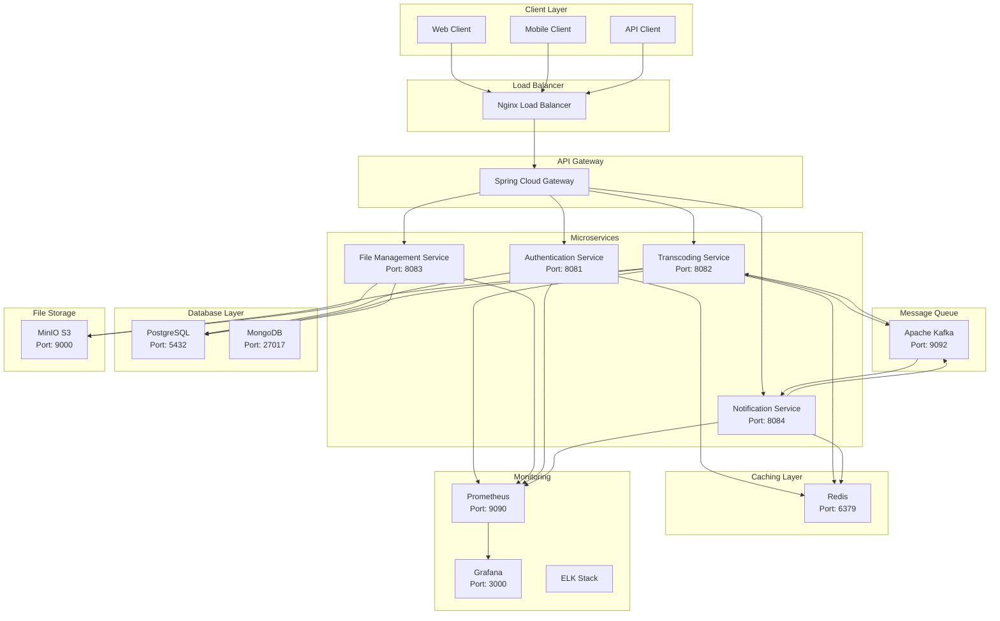

# Video Transcoding Service

A comprehensive Java Spring Boot application for video transcoding with support for various codecs, formats, and quality settings. The service provides RESTful APIs for video conversion with configurable parameters including bitrate, frame rate, resolution, and processing mode (CPU/GPU).

## Architecture Overview



## Features

- **Video Transcoding**: Support for multiple video codecs (H.264, H.265, AV1)
- **Audio Processing**: Multiple audio codecs (AAC, MP3, Opus)
- **Format Support**: Various output formats (MP4, WebM, AVI)
- **Quality Control**: Configurable bitrate, resolution, and frame rate
- **Processing Modes**: CPU and GPU acceleration support
- **System Information**: Detailed CPU/GPU information logging
- **Microservices Architecture**: Scalable and maintainable design
- **Message Queue Integration**: Async processing with Kafka
- **Caching**: Redis for performance optimization
- **File Storage**: MinIO S3-compatible storage
- **Monitoring**: Comprehensive monitoring with Prometheus and Grafana

## System Requirements

### Minimum Requirements
- Java 17+
- Spring Boot 3.2+
- Docker 20.10+
- Docker Compose 2.0+
- 8GB RAM
- 4 CPU cores
- 50GB storage

### Recommended for GPU Processing
- NVIDIA GPU with CUDA support
- NVIDIA Docker runtime
- CUDA 11.0+

## API Endpoints

### Authentication Service (Port: 8081)

#### Register User
```bash
curl -X POST http://localhost:8081/api/auth/register \
  -H "Content-Type: application/json" \
  -d '{
    "username": "testuser",
    "email": "test@example.com",
    "password": "password123"
  }'
```

#### Login
```bash
curl -X POST http://localhost:8081/api/auth/login \
  -H "Content-Type: application/json" \
  -d '{
    "username": "testuser",
    "password": "password123"
  }'
```

### File Management Service (Port: 8083)

#### Upload Video File
```bash
curl -X POST http://localhost:8083/api/files/upload \
  -H "Authorization: Bearer YOUR_JWT_TOKEN" \
  -F "file=@/path/to/video.mp4" \
  -F "description=Test video upload"
```

#### Get File Information
```bash
curl -X GET http://localhost:8083/api/files/{fileId} \
  -H "Authorization: Bearer YOUR_JWT_TOKEN"
```

#### Download File
```bash
curl -X GET http://localhost:8083/api/files/{fileId}/download \
  -H "Authorization: Bearer YOUR_JWT_TOKEN" \
  -o downloaded_video.mp4
```

### Transcoding Service (Port: 8082)

#### Get System Information
```bash
curl -X GET http://localhost:8082/api/transcode/system-info \
  -H "Authorization: Bearer YOUR_JWT_TOKEN"
```

#### Start Transcoding Job
```bash
curl -X POST http://localhost:8082/api/transcode/jobs \
  -H "Authorization: Bearer YOUR_JWT_TOKEN" \
  -H "Content-Type: application/json" \
  -d '{
    "inputFileId": "file-uuid-123",
    "outputSettings": {
      "videoCodec": "libx264",
      "audioCodec": "aac",
      "outputFormat": "mp4",
      "videoBitrate": "2000k",
      "audioBitrate": "128k",
      "resolution": "1920x1080",
      "frameRate": 30,
      "processingMode": "CPU"
    },
    "priority": "NORMAL"
  }'
```

#### Get Transcoding Job Status
```bash
curl -X GET http://localhost:8082/api/transcode/jobs/{jobId} \
  -H "Authorization: Bearer YOUR_JWT_TOKEN"
```

#### Get All User Jobs
```bash
curl -X GET http://localhost:8082/api/transcode/jobs?page=0&size=10&status=COMPLETED \
  -H "Authorization: Bearer YOUR_JWT_TOKEN"
```

#### Cancel Transcoding Job
```bash
curl -X DELETE http://localhost:8082/api/transcode/jobs/{jobId} \
  -H "Authorization: Bearer YOUR_JWT_TOKEN"
```

#### Bulk Transcode
```bash
curl -X POST http://localhost:8082/api/transcode/bulk \
  -H "Authorization: Bearer YOUR_JWT_TOKEN" \
  -H "Content-Type: application/json" \
  -d '{
    "inputFileIds": ["file-uuid-1", "file-uuid-2"],
    "outputSettings": {
      "videoCodec": "libx265",
      "audioCodec": "aac",
      "outputFormat": "mp4",
      "videoBitrate": "1500k",
      "audioBitrate": "128k",
      "resolution": "1280x720",
      "frameRate": 24,
      "processingMode": "GPU"
    }
  }'
```

### Notification Service (Port: 8084)

#### Get User Notifications
```bash
curl -X GET http://localhost:8084/api/notifications \
  -H "Authorization: Bearer YOUR_JWT_TOKEN"
```

#### Mark Notification as Read
```bash
curl -X PATCH http://localhost:8084/api/notifications/{notificationId}/read \
  -H "Authorization: Bearer YOUR_JWT_TOKEN"
```

## Installation & Configuration

### 1. Clone Repository
```bash
git clone https://github.com/yourusername/video-transcoding-service.git
cd video-transcoding-service
```

### 2. Environment Variables

Create `.env` file in the root directory:

```bash
# Database Configuration
POSTGRES_DB=transcode_db
POSTGRES_USER=transcode_user
POSTGRES_PASSWORD=secure_password_123
POSTGRES_HOST=postgres
POSTGRES_PORT=5432

MONGODB_DATABASE=transcode_files
MONGODB_USERNAME=mongo_user
MONGODB_PASSWORD=mongo_password_123
MONGODB_HOST=mongodb
MONGODB_PORT=27017

# Redis Configuration
REDIS_HOST=redis
REDIS_PORT=6379
REDIS_PASSWORD=redis_password_123

# Kafka Configuration
KAFKA_BOOTSTRAP_SERVERS=kafka:9092
KAFKA_GROUP_ID=transcode-service-group

# MinIO Configuration
MINIO_ENDPOINT=http://minio:9000
MINIO_ACCESS_KEY=minioadmin
MINIO_SECRET_KEY=minioadmin123
MINIO_BUCKET_NAME=video-files

# JWT Configuration
JWT_SECRET=your-super-secret-jwt-key-change-this-in-production
JWT_EXPIRATION=86400000

# FFmpeg Configuration
FFMPEG_PATH=/usr/local/bin/ffmpeg
FFPROBE_PATH=/usr/local/bin/ffprobe

# Processing Configuration
MAX_CONCURRENT_JOBS=4
TEMP_DIR=/tmp/transcode
OUTPUT_DIR=/app/output

# GPU Configuration
ENABLE_GPU_ACCELERATION=false
CUDA_VISIBLE_DEVICES=0

# Logging
LOG_LEVEL=INFO
LOG_FILE_PATH=/var/log/transcode-service.log
```

### 3. Docker Commands

#### Build Individual Services
```bash
# Build Authentication Service
docker build -t transcode/auth-service ./auth-service

# Build Transcoding Service
docker build -t transcode/transcode-service ./transcoding-service

# Build File Management Service
docker build -t transcode/file-service ./file-service

# Build Notification Service
docker build -t transcode/notification-service ./notification-service
```

#### Run with Docker Compose
```bash
# Start all services
docker-compose up -d

# Start with build
docker-compose up -d --build

# View logs
docker-compose logs -f transcode-service

# Stop all services
docker-compose down

# Stop and remove volumes
docker-compose down -v
```

## Docker Compose Configuration

### docker-compose.yml
```yaml
version: '3.8'

services:
  # Database Services
  postgres:
    image: postgres:15-alpine
    container_name: transcode-postgres
    environment:
      POSTGRES_DB: ${POSTGRES_DB}
      POSTGRES_USER: ${POSTGRES_USER}
      POSTGRES_PASSWORD: ${POSTGRES_PASSWORD}
    ports:
      - "5432:5432"
    volumes:
      - postgres_data:/var/lib/postgresql/data
      - ./scripts/init-postgres.sql:/docker-entrypoint-initdb.d/init.sql
    healthcheck:
      test: ["CMD-SHELL", "pg_isready -U ${POSTGRES_USER} -d ${POSTGRES_DB}"]
      interval: 30s
      timeout: 10s
      retries: 3
    networks:
      - transcode-network

  mongodb:
    image: mongo:6.0
    container_name: transcode-mongodb
    environment:
      MONGO_INITDB_ROOT_USERNAME: ${MONGODB_USERNAME}
      MONGO_INITDB_ROOT_PASSWORD: ${MONGODB_PASSWORD}
      MONGO_INITDB_DATABASE: ${MONGODB_DATABASE}
    ports:
      - "27017:27017"
    volumes:
      - mongodb_data:/data/db
    healthcheck:
      test: ["CMD", "mongosh", "--eval", "db.adminCommand('ping')"]
      interval: 30s
      timeout: 10s
      retries: 3
    networks:
      - transcode-network

  # Caching Service
  redis:
    image: redis:7-alpine
    container_name: transcode-redis
    command: redis-server --requirepass ${REDIS_PASSWORD}
    ports:
      - "6379:6379"
    volumes:
      - redis_data:/data
    healthcheck:
      test: ["CMD", "redis-cli", "--raw", "incr", "ping"]
      interval: 30s
      timeout: 10s
      retries: 3
    networks:
      - transcode-network

  # Message Queue
  zookeeper:
    image: confluentinc/cp-zookeeper:7.4.0
    container_name: transcode-zookeeper
    environment:
      ZOOKEEPER_CLIENT_PORT: 2181
      ZOOKEEPER_TICK_TIME: 2000
    networks:
      - transcode-network

  kafka:
    image: confluentinc/cp-kafka:7.4.0
    container_name: transcode-kafka
    depends_on:
      - zookeeper
    ports:
      - "9092:9092"
    environment:
      KAFKA_BROKER_ID: 1
      KAFKA_ZOOKEEPER_CONNECT: zookeeper:2181
      KAFKA_LISTENER_SECURITY_PROTOCOL_MAP: PLAINTEXT:PLAINTEXT,PLAINTEXT_HOST:PLAINTEXT
      KAFKA_ADVERTISED_LISTENERS: PLAINTEXT://kafka:29092,PLAINTEXT_HOST://localhost:9092
      KAFKA_INTER_BROKER_LISTENER_NAME: PLAINTEXT
      KAFKA_OFFSETS_TOPIC_REPLICATION_FACTOR: 1
      KAFKA_GROUP_INITIAL_REBALANCE_DELAY_MS: 0
      KAFKA_CONFLUENT_SCHEMA_REGISTRY_URL: http://schema-registry:8081
    healthcheck:
      test: ["CMD", "kafka-broker-api-versions", "--bootstrap-server", "localhost:9092"]
      interval: 30s
      timeout: 10s
      retries: 3
    networks:
      - transcode-network

  # File Storage
  minio:
    image: minio/minio:latest
    container_name: transcode-minio
    command: server /data --console-address ":9001"
    environment:
      MINIO_ROOT_USER: ${MINIO_ACCESS_KEY}
      MINIO_ROOT_PASSWORD: ${MINIO_SECRET_KEY}
    ports:
      - "9000:9000"
      - "9001:9001"
    volumes:
      - minio_data:/data
    healthcheck:
      test: ["CMD", "curl", "-f", "http://localhost:9000/minio/health/live"]
      interval: 30s
      timeout: 20s
      retries: 3
    networks:
      - transcode-network

  # Microservices
  auth-service:
    build: ./auth-service
    container_name: transcode-auth-service
    environment:
      SPRING_PROFILES_ACTIVE: docker
      POSTGRES_HOST: postgres
      POSTGRES_PORT: 5432
      POSTGRES_DB: ${POSTGRES_DB}
      POSTGRES_USER: ${POSTGRES_USER}
      POSTGRES_PASSWORD: ${POSTGRES_PASSWORD}
      REDIS_HOST: redis
      REDIS_PORT: 6379
      REDIS_PASSWORD: ${REDIS_PASSWORD}
      JWT_SECRET: ${JWT_SECRET}
      JWT_EXPIRATION: ${JWT_EXPIRATION}
    ports:
      - "8081:8081"
    depends_on:
      postgres:
        condition: service_healthy
      redis:
        condition: service_healthy
    volumes:
      - ./logs:/var/log
    networks:
      - transcode-network

  file-service:
    build: ./file-service
    container_name: transcode-file-service
    environment:
      SPRING_PROFILES_ACTIVE: docker
      POSTGRES_HOST: postgres
      POSTGRES_PORT: 5432
      POSTGRES_DB: ${POSTGRES_DB}
      POSTGRES_USER: ${POSTGRES_USER}
      POSTGRES_PASSWORD: ${POSTGRES_PASSWORD}
      MINIO_ENDPOINT: http://minio:9000
      MINIO_ACCESS_KEY: ${MINIO_ACCESS_KEY}
      MINIO_SECRET_KEY: ${MINIO_SECRET_KEY}
      MINIO_BUCKET_NAME: ${MINIO_BUCKET_NAME}
    ports:
      - "8083:8083"
    depends_on:
      postgres:
        condition: service_healthy
      minio:
        condition: service_healthy
    volumes:
      - ./logs:/var/log
      - ./temp:/tmp/uploads
    networks:
      - transcode-network

  transcoding-service:
    build: ./transcoding-service
    container_name: transcode-service
    environment:
      SPRING_PROFILES_ACTIVE: docker
      POSTGRES_HOST: postgres
      POSTGRES_PORT: 5432
      POSTGRES_DB: ${POSTGRES_DB}
      POSTGRES_USER: ${POSTGRES_USER}
      POSTGRES_PASSWORD: ${POSTGRES_PASSWORD}
      REDIS_HOST: redis
      REDIS_PORT: 6379
      REDIS_PASSWORD: ${REDIS_PASSWORD}
      KAFKA_BOOTSTRAP_SERVERS: kafka:29092
      MINIO_ENDPOINT: http://minio:9000
      MINIO_ACCESS_KEY: ${MINIO_ACCESS_KEY}
      MINIO_SECRET_KEY: ${MINIO_SECRET_KEY}
      MINIO_BUCKET_NAME: ${MINIO_BUCKET_NAME}
      FFMPEG_PATH: ${FFMPEG_PATH}
      FFPROBE_PATH: ${FFPROBE_PATH}
      MAX_CONCURRENT_JOBS: ${MAX_CONCURRENT_JOBS}
      TEMP_DIR: ${TEMP_DIR}
      OUTPUT_DIR: ${OUTPUT_DIR}
      ENABLE_GPU_ACCELERATION: ${ENABLE_GPU_ACCELERATION}
    ports:
      - "8082:8082"
    depends_on:
      postgres:
        condition: service_healthy
      redis:
        condition: service_healthy
      kafka:
        condition: service_healthy
      minio:
        condition: service_healthy
    volumes:
      - ./logs:/var/log
      - ./temp:/tmp/transcode
      - ./output:/app/output
    networks:
      - transcode-network

  notification-service:
    build: ./notification-service
    container_name: transcode-notification-service
    environment:
      SPRING_PROFILES_ACTIVE: docker
      POSTGRES_HOST: postgres
      POSTGRES_PORT: 5432
      POSTGRES_DB: ${POSTGRES_DB}
      POSTGRES_USER: ${POSTGRES_USER}
      POSTGRES_PASSWORD: ${POSTGRES_PASSWORD}
      REDIS_HOST: redis
      REDIS_PORT: 6379
      REDIS_PASSWORD: ${REDIS_PASSWORD}
      KAFKA_BOOTSTRAP_SERVERS: kafka:29092
    ports:
      - "8084:8084"
    depends_on:
      postgres:
        condition: service_healthy
      redis:
        condition: service_healthy
      kafka:
        condition: service_healthy
    volumes:
      - ./logs:/var/log
    networks:
      - transcode-network

  # Load Balancer
  nginx:
    image: nginx:alpine
    container_name: transcode-nginx
    ports:
      - "80:80"
      - "443:443"
    volumes:
      - ./nginx/nginx.conf:/etc/nginx/nginx.conf
      - ./nginx/ssl:/etc/nginx/ssl
    depends_on:
      - auth-service
      - file-service
      - transcoding-service
      - notification-service
    networks:
      - transcode-network

  # Monitoring
  prometheus:
    image: prom/prometheus:latest
    container_name: transcode-prometheus
    ports:
      - "9090:9090"
    volumes:
      - ./prometheus/prometheus.yml:/etc/prometheus/prometheus.yml
      - prometheus_data:/prometheus
    networks:
      - transcode-network

  grafana:
    image: grafana/grafana:latest
    container_name: transcode-grafana
    ports:
      - "3000:3000"
    environment:
      GF_SECURITY_ADMIN_PASSWORD: admin123
    volumes:
      - grafana_data:/var/lib/grafana
      - ./grafana/dashboards:/var/lib/grafana/dashboards
      - ./grafana/provisioning:/etc/grafana/provisioning
    networks:
      - transcode-network

volumes:
  postgres_data:
  mongodb_data:
  redis_data:
  minio_data:
  prometheus_data:
  grafana_data:

networks:
  transcode-network:
    driver: bridge
```

## JUnit Test Classes

### Transcoding Controller Tests
```java
@SpringBootTest
@AutoConfigureMockMvc
@TestPropertySource(locations = "classpath:application-test.properties")
class TranscodingControllerTest {

    @Autowired
    private MockMvc mockMvc;

    @MockBean
    private TranscodingService transcodingService;

    @MockBean
    private JwtUtil jwtUtil;

    @Test
    @WithMockUser(roles = "USER")
    void testCreateTranscodingJob_Success() throws Exception {
        // Test implementation
        TranscodingJobDto jobDto = createTestJobDto();
        TranscodingJob expectedJob = createTestJob();
        
        when(transcodingService.createTranscodingJob(any(), any())).thenReturn(expectedJob);

        mockMvc.perform(post("/api/transcode/jobs")
                .contentType(MediaType.APPLICATION_JSON)
                .content(objectMapper.writeValueAsString(jobDto))
                .header("Authorization", "Bearer valid-token"))
                .andExpect(status().isCreated())
                .andExpect(jsonPath("$.id").value(expectedJob.getId()))
                .andExpect(jsonPath("$.status").value("QUEUED"));
    }

    @Test
    @WithMockUser(roles = "USER")
    void testGetSystemInfo_Success() throws Exception {
        SystemInfo systemInfo = SystemInfo.builder()
            .cpuInfo("Intel Core i7-9700K")
            .gpuInfo("NVIDIA GeForce GTX 1080")
            .totalMemory(16384L)
            .availableMemory(8192L)
            .build();

        when(transcodingService.getSystemInfo()).thenReturn(systemInfo);

        mockMvc.perform(get("/api/transcode/system-info")
                .header("Authorization", "Bearer valid-token"))
                .andExpected(status().isOk())
                .andExpect(jsonPath("$.cpuInfo").value("Intel Core i7-9700K"))
                .andExpect(jsonPath("$.gpuInfo").value("NVIDIA GeForce GTX 1080"));
    }
}
```

### Transcoding Service Tests
```java
@ExtendWith(MockitoExtension.class)
class TranscodingServiceTest {

    @Mock
    private TranscodingJobRepository jobRepository;

    @Mock
    private FileService fileService;

    @Mock
    private FFmpegService ffmpegService;

    @Mock
    private KafkaTemplate<String, Object> kafkaTemplate;

    @InjectMocks
    private TranscodingService transcodingService;

    @Test
    void testCreateTranscodingJob_Success() {
        // Test implementation
        User user = createTestUser();
        TranscodingJobDto jobDto = createTestJobDto();
        TranscodingJob savedJob = createTestJob();

        when(jobRepository.save(any(TranscodingJob.class))).thenReturn(savedJob);

        TranscodingJob result = transcodingService.createTranscodingJob(user, jobDto);

        assertThat(result).isNotNull();
        assertThat(result.getStatus()).isEqualTo(TranscodingStatus.QUEUED);
        verify(kafkaTemplate).send(eq("transcoding-jobs"), any(TranscodingJobEvent.class));
    }

    @Test
    void testProcessTranscodingJob_Success() {
        // Test implementation
        TranscodingJob job = createTestJob();
        File inputFile = new File("test-input.mp4");
        File outputFile = new File("test-output.mp4");

        when(fileService.downloadFile(job.getInputFileId())).thenReturn(inputFile);
        when(ffmpegService.transcode(any(), any(), any())).thenReturn(true);

        transcodingService.processTranscodingJob(job);

        verify(jobRepository).save(argThat(j -> j.getStatus() == TranscodingStatus.COMPLETED));
    }
}
```

### Repository Tests
```java
@DataJpaTest
@TestPropertySource(locations = "classpath:application-test.properties")
class TranscodingJobRepositoryTest {

    @Autowired
    private TestEntityManager entityManager;

    @Autowired
    private TranscodingJobRepository jobRepository;

    @Test
    void testFindByUserIdAndStatus() {
        // Test implementation
        User user = createAndPersistTestUser();
        TranscodingJob job1 = createTestJob(user, TranscodingStatus.COMPLETED);
        TranscodingJob job2 = createTestJob(user, TranscodingStatus.PROCESSING);
        
        entityManager.persistAndFlush(job1);
        entityManager.persistAndFlush(job2);

        List<TranscodingJob> completedJobs = jobRepository
            .findByUserIdAndStatus(user.getId(), TranscodingStatus.COMPLETED);

        assertThat(completedJobs).hasSize(1);
        assertThat(completedJobs.get(0).getStatus()).isEqualTo(TranscodingStatus.COMPLETED);
    }

    @Test
    void testFindQueuedJobsOrderByPriorityAndCreatedAt() {
        // Test implementation with different priorities
        User user = createAndPersistTestUser();
        
        TranscodingJob highPriorityJob = createTestJob(user, TranscodingStatus.QUEUED);
        highPriorityJob.setPriority(JobPriority.HIGH);
        highPriorityJob.setCreatedAt(LocalDateTime.now().minusHours(2));
        
        TranscodingJob normalPriorityJob = createTestJob(user, TranscodingStatus.QUEUED);
        normalPriorityJob.setPriority(JobPriority.NORMAL);
        normalPriorityJob.setCreatedAt(LocalDateTime.now().minusHours(1));

        entityManager.persistAndFlush(normalPriorityJob);
        entityManager.persistAndFlush(highPriorityJob);

        List<TranscodingJob> queuedJobs = jobRepository.findQueuedJobsOrderByPriorityAndCreatedAt();

        assertThat(queuedJobs).hasSize(2);
        assertThat(queuedJobs.get(0).getPriority()).isEqualTo(JobPriority.HIGH);
    }
}
```

### Security Tests
```java
@SpringBootTest
@AutoConfigureMockMvc
class SecurityConfigTest {

    @Autowired
    private MockMvc mockMvc;

    @Test
    void testUnauthorizedAccess_Returns401() throws Exception {
        mockMvc.perform(get("/api/transcode/jobs"))
                .andExpect(status().isUnauthorized());
    }

    @Test
    void testValidToken_AllowsAccess() throws Exception {
        String validToken = generateValidJwtToken();
        
        mockMvc.perform(get("/api/transcode/system-info")
                .header("Authorization", "Bearer " + validToken))
                .andExpect(status().isOk());
    }

    @Test
    void testInvalidToken_Returns401() throws Exception {
        mockMvc.perform(get("/api/transcode/jobs")
                .header("Authorization", "Bearer invalid-token"))
                .andExpected(status().isUnauthorized());
    }
}
```

## Configuration Files

### application.yml (Transcoding Service)
```yaml
server:
  port: 8082

spring:
  application:
    name: transcoding-service
  
  profiles:
    active: ${SPRING_PROFILES_ACTIVE:dev}
  
  datasource:
    url: jdbc:postgresql://${POSTGRES_HOST:localhost}:${POSTGRES_PORT:5432}/${POSTGRES_DB:transcode_db}
    username: ${POSTGRES_USER:transcode_user}
    password: ${POSTGRES_PASSWORD:password}
    driver-class-name: org.postgresql.Driver
    
  jpa:
    hibernate:
      ddl-auto: validate
    properties:
      hibernate:
        dialect: org.hibernate.dialect.PostgreSQLDialect
        format_sql: true
    show-sql: false
    
  redis:
    host: ${REDIS_HOST:localhost}
    port: ${REDIS_PORT:6379}
    password: ${REDIS_PASSWORD:}
    timeout: 2000ms
    jedis:
      pool:
        max-active: 8
        max-wait: -1ms
        max-idle: 8
        min-idle: 0
        
  kafka:
    bootstrap-servers: ${KAFKA_BOOTSTRAP_SERVERS:localhost:9092}
    producer:
      key-serializer: org.apache.kafka.common.serialization.StringSerializer
      value-serializer: org.springframework.kafka.support.serializer.JsonSerializer
    consumer:
      group-id: ${KAFKA_GROUP_ID:transcode-service-group}
      key-deserializer: org.apache.kafka.common.serialization.StringDeserializer
      value-deserializer: org.springframework.kafka.support.serializer.JsonDeserializer
      properties:
        spring.json.trusted.packages: "*"

# Custom Application Properties
transcoding:
  ffmpeg:
    path: ${FFMPEG_PATH:/usr/local/bin/ffmpeg}
    probe-path: ${FFPROBE_PATH:/usr/local/bin/ffprobe}
  
  processing:
    max-concurrent-jobs: ${MAX_CONCURRENT_JOBS:4}
    temp-directory: ${TEMP_DIR:/tmp/transcode}
    output-directory: ${OUTPUT_DIR:/app/output}
    cleanup-temp-files: true
    
  gpu:
    enabled: ${ENABLE_GPU_ACCELERATION:false}
    cuda-devices: ${CUDA_VISIBLE_DEVICES:0}
    
  defaults:
    video-codec: libx264
    audio-codec: aac
    output-format: mp4
    video-bitrate: 1500k
    audio-bitrate: 128k
    frame-rate: 30
    resolution: 1280x720

storage:
  minio:
    endpoint: ${MINIO_ENDPOINT:http://localhost:9000}
    access-key: ${MINIO_ACCESS_KEY:minioadmin}
    secret-key: ${MINIO_SECRET_KEY:minioadmin}
    bucket-name: ${MINIO_BUCKET_NAME:video-files}

logging:
  level:
    com.transcodeservice: ${LOG_LEVEL:INFO}
    org.springframework.security: DEBUG
  pattern:
    file: "%d{yyyy-MM-dd HH:mm:ss} [%thread] %-5level %logger{36} - %msg%n"
  file:
    name: ${LOG_FILE_PATH:/var/log/transcode-service.log}

management:
  endpoints:
    web:
      exposure:
        include: health,info,metrics,prometheus
  endpoint:
    health:
      show-details: always
  metrics:
    export:
      prometheus:
        enabled: true
```

## Usage Examples

### Basic Transcoding
```bash
# 1. Upload a video file
UPLOAD_RESPONSE=$(curl -s -X POST http://localhost:8083/api/files/upload \
  -H "Authorization: Bearer $JWT_TOKEN" \
  -F "file=@sample